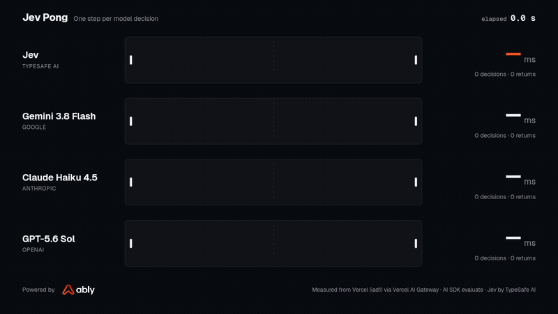
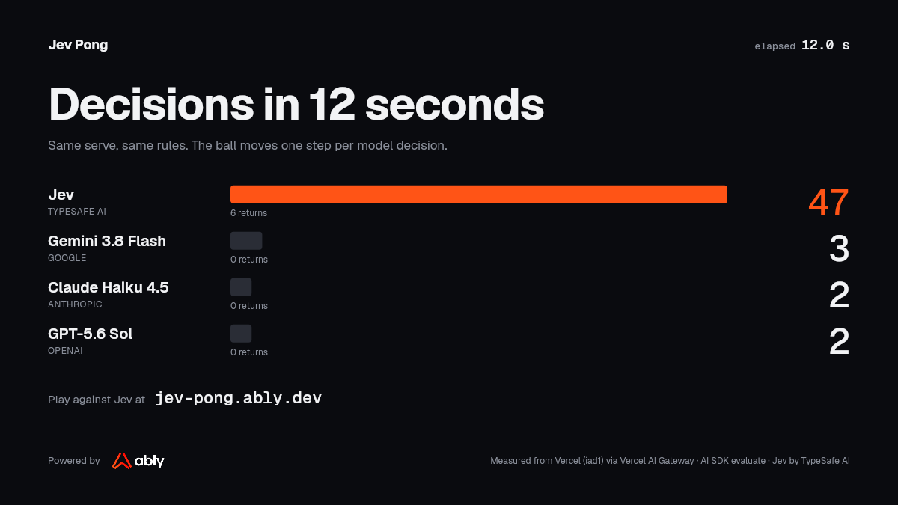
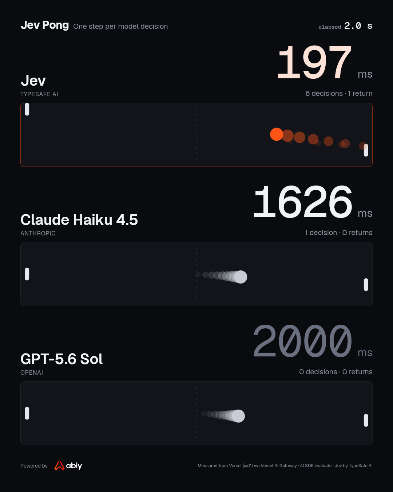

# Jev Pong

Pong where the ball moves one step per model decision. Slow model, slow ball.



**Play it: [jev-pong.ably.dev](https://jev-pong.ably.dev)**, arrow keys or W/S, drag on a phone. The [how page](https://jev-pong.ably.dev/how) shows the real state and the real question every model gets.

## Why I built this

I'm Matt, co-founder of [Ably](https://ably.com). Jev landed on Vercel AI Gateway on September 16, 2026, and two days later this was playable, because the model is a string id and one AI SDK call.

I wanted to see one thing for myself: whether a model that answers in a couple of hundred milliseconds changes what an agent can be. Everything we've built with AI so far waits. Request and response waits for the answer. Streaming and background agents wait more gracefully. A model that decides inside human reaction time can be a participant in what you're doing right now, and a game is the least forgiving place to test that, because the ball doesn't wait.

This is a latency demo, not an intelligence demo. The chat models answered the same question correctly 95 to 100 percent of the time in our runs. They're slow because they answer with language, and this question doesn't need a paragraph. Jev is a typed-decision model, state in and a typed choice out, so it doesn't generate any. That's the whole difference, and it's enough to make the ball move.

The other half of the demo is how the agent takes part. It isn't behind a request. It's a member of the same Ably channel as the player: present, reading the paddle input, publishing the ball, watchable by anyone with the link. That's the pattern we think live agents need, and it's why the code is open.

## The numbers

Four lanes play the same game with a different model on the right paddle. Same serve, same rules, same question, same Vercel AI Gateway key. One decision moves the ball one segment, eight segments cross the court, and nothing is skipped or sped up. A lane's speed is that model's decision latency and nothing else.

Recorded on Vercel (iad1) through the Gateway on September 17, 2026, 45 seconds per lane. Every figure on the site is read from `public/replay-stats.json` at build time; nothing is typed in by hand.

| Model | How it answers | Decisions per second | Average | p95 | Decisions in the first 12 s |
|---|---|---|---|---|---|
| Jev (TypeSafe AI) | `experimental_evaluate`, a typed choice | 4.4 | 227 ms | 400 ms | 47 |
| Gemini 3.8 Flash | structured output | 0.32 | 3.2 s | 7.4 s | 3 |
| Claude Haiku 4.5 | structured output | 0.40 | 2.5 s | 8.4 s | 2 |
| GPT-5.6 Sol | structured output | 0.28 | 3.5 s | 10.4 s | 2 |



Jev is reachable through Vercel AI Gateway as `typesafe-ai/jev` with AI SDK 7.0.105 or later; see the [Vercel changelog](https://vercel.com/changelog/typesafe-ai-jev-now-available-on-ai-gateway), the [evaluate docs](https://ai-sdk.dev/docs/ai-sdk-core/evaluation), and [TypeSafe's launch post](https://typesafe.ai/blog/introducing-system-one-models-and-jev). The chat models are asked the identical question through the same Gateway with structured output at temperature 0, reasoning off, and no retries for anyone.

Why Pong: in the [Atari-GPT benchmark](https://arxiv.org/html/2408.15950v2), Pong was the game chat models handled worst, below random, because deciding takes them longer than the game gives them.

### Since then: other models, same question

The four lanes were chosen to be simple: one typed-decision model against the three chat models most people recognise. After launch, people asked about the newest frontier models, so on September 19, 2026 the same question went to them too: 30 real game states, one call per decision, sequential, reasoning switched to the lowest setting each provider accepts (Astra refuses "minimal" and takes low, medium or high; Fable 5.1 refuses "disabled" and takes adaptive with an effort). This run was made from a laptop through the Gateway rather than from Vercel, so every row carries the same request overhead, about 120 ms, which the last column removes before dividing. The data is `public/model-comparison.json` and the how page renders it.

| Model | Setting | Correct | Median | p95 | Slower than Jev |
|---|---|---|---|---|---|
| Jev | evaluate | 29/30 | 359 ms | 518 ms | 1.0x |
| Claude Haiku 4.5 | thinking off | 30/30 | 942 ms | 1572 ms | 3.4x |
| GPT-6 Astra-fast | effort low | 30/30 | 1402 ms | 1884 ms | 5.4x |
| GPT-5.6 Sol | default | 30/30 | 1485 ms | 2343 ms | 5.7x |
| GPT-6 Astra | effort low | 30/30 | 1774 ms | 2193 ms | 6.9x |
| GPT-6 Astra | effort high | 30/30 | 1733 ms | 2747 ms | 6.7x |
| Claude Fable 5.1 | adaptive, effort low | 30/30 | 3902 ms | 4918 ms | 15.8x |

Astra's medium effort landed between low and high, and Fable at high effort changed nothing. Every chat model answered all 30 correctly; Jev missed one. Not smarter, faster. The script is `.working/frontier-compare.mts` in a checkout; it is not part of the app.

## What counts as one decision

The state is a JSON object of numbers and nothing else, about 125 bytes. The engine builds the real one from a served game:

```json
{"court":{"w":160,"h":100},"ball":{"x":80,"y":50,"vx":19,"vy":4.4},"paddle":{"y":50,"h":20},"interceptY":67.4,"dir":"toward"}
```

The question is `DECISION_INSTRUCTIONS` in `lib/decide/prompt.ts`: it states the court semantics and asks for the right paddle to cover `interceptY`, treating the paddle as already covering it when within five units. There are three answers, `up`, `down`, and `stay`, described by `MOVE_CRITERIA` in the same file. Every lane reads those two constants, so nothing is worded twice.

The number beside a lane is the round trip of that one call, timed on the server around the model call and nothing else.

## How a game runs

Every participant in a game is a member of one Ably channel, `pong:game:{id}`, including the agent.

- The browser gets a short-lived token from `/api/ably-token`, enters presence as a player, subscribes to `state`, and publishes `input`. An input is a level, not an event: `up`, `down`, or `stay`, repeated every 150 ms while held, and the worker forgets it after 400 ms, so a closed laptop can never pin a paddle against the wall.
- The agent is a Node process started by `POST /api/game` and kept alive inside the same Vercel function invocation with `after()`, for up to the function's `maxDuration`. It joins the channel with the API key, enters presence as `agent`, runs the physics, asks the model for a move once per ball step, and publishes a `state` snapshot after every decision, every paddle movement, and at least once a second.
- Spectators attach to the same channel with `rewind` and enter presence as spectators. The viewer count is presence. A second human is one more player on the channel, which is why human versus human needs no extra code.
- A referee ends the game when a score reaches five, when a player has been gone for 15 seconds, when nobody took a side within a minute, when a demo has been unwatched for two minutes, or 15 seconds before the platform deadline. The final frame says why, and the agent leaves presence.

In a mode a human plays, a ball step never completes faster than 260 ms, even when Jev answers sooner. The published latency is still the real model latency. Demo mode is unpaced.

### What the browser predicts

The court is drawn from the wire, one step behind the worker, with two exceptions that are worth reading because they are where "it feels wrong" lived.

The player's own paddle is predicted locally the moment a key goes down, at the worker's own speed, and reconciled against the wire only after a frame acknowledges the player's latest input (`Snapshot.inputSeq`). Reconciling earlier drags the paddle back toward a position that is a round trip old. The ball's step is timed by the worker's clock, not by when its frames arrived, and a frame that lands early continues the walk from where the ball is drawn rather than jumping. `lib/ui/paddle.ts` and `lib/render/live.ts` are both pure and both tested.

## Read the code in this order

1. `lib/game/types.ts`: the contract. The court, the mechanic (one decision is one tick), and `DecisionState`, the 125 bytes a model is given.
2. `lib/game/engine.ts`: the whole game as pure functions. One segment of ball per decision, the paddle planes the ball turns at, and the scripted left paddle that never misses.
3. `lib/decide/prompt.ts`: the one question every model is asked, and its three answers.
4. `lib/decide/jev.ts` and `lib/decide/llm.ts`: the two ways the question is put, `experimental_evaluate` for Jev and structured output for the chat models. Both time the model call and nothing else.
5. `lib/worker/game-worker.ts`: the agent as a member of the channel. The decision loop that advances the ball, the continuously moving human paddle, the input acknowledgement, and what goes on the wire.
6. `lib/worker/referee.ts`: when a game stops, as a pure state machine with no clock of its own.
7. `app/api/game/route.ts`: one HTTP request, one function, one game.
8. `lib/ably/hooks.ts`: everything a browser does. Subscribe to snapshots, be present, publish input. No game logic.

## Run it

```bash
pnpm install
cp .env.example .env.local   # then fill in the two keys
pnpm dev
```

| Variable | Used by | Notes |
|---|---|---|
| `AI_GATEWAY_API_KEY` | `/api/game` (worker), `/api/record`, `/api/decide` | Vercel AI Gateway key. On Vercel, OIDC works instead. |
| `ABLY_API_KEY` | `/api/ably-token`, `/api/game` | Server only. Mints browser tokens and connects the agent. No API key reaches a browser. |
| `MAX_LIVE_GAMES` | `/api/game` | Optional cap on concurrent agent workers (default 20). |
| `ADMIN_TOKEN` | `/arena`, demo games, `/api/record` | Gate for anything that spends credit with nobody playing. Pass as `x-admin-token` or `?token=`. |

When the Gateway budget is exhausted the API returns `out_of_credits` and the lane shows it. No meter, no retries.

```bash
pnpm test        # engine determinism, the sampler and paddle prediction, referee rules, worker lifecycle, token route
pnpm typecheck
pnpm lint
```

To re-record the numbers, deploy and `POST /api/record` with the admin token, so the latencies are measured next to the Gateway rather than on your broadband. The response is the replay and its stats; drop them into `public/`. `pnpm render:clip` turns the replay into the clips in `public/media`: `--layout wide` for this page, `--layout social` for a 4:5 phone cut of all four lanes, and `--layout duel --lanes jev,haiku,gpt` for the three-lane cut below.



Deploying to Vercel needs the two keys as environment variables, `vercel.json` (already here, so Vercel builds it as Next.js), and a plan whose functions can run for the length of a game. Web Analytics is on: cookieless page views and four custom events (game started, game over, watch opened, share copied), listed in `lib/ui/analytics.ts`. Nothing a person types is sent.

## Stack and credits

Next.js 16 (App Router) on Vercel. `ai` 7 with the Gateway provider. `ably` 2 with `ably/react`. Canvas courts, Tailwind 4, no game engine library.

Jev is by [TypeSafe AI](https://typesafe.ai), reachable through [Vercel AI Gateway](https://vercel.com/ai-gateway). Realtime agent transport by [Ably](https://ably.com/ai-transport). An [Ably Labs](https://github.com/ably-labs) demo, Apache 2.0.
